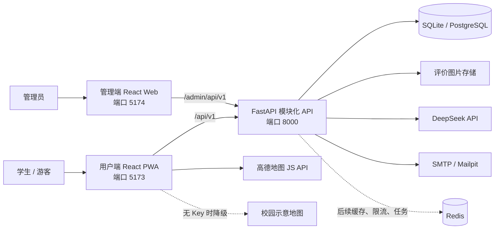
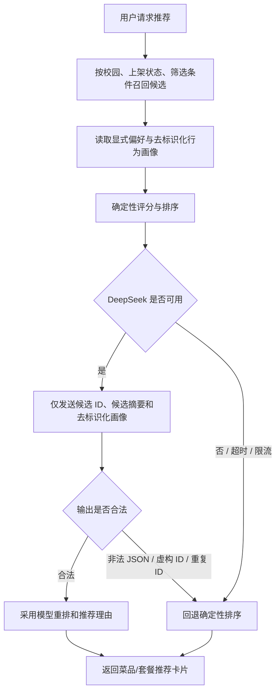
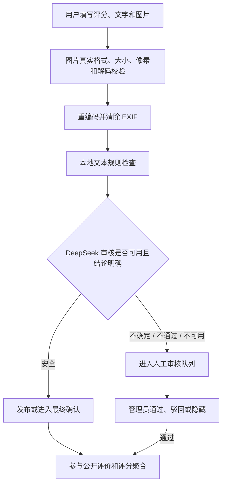
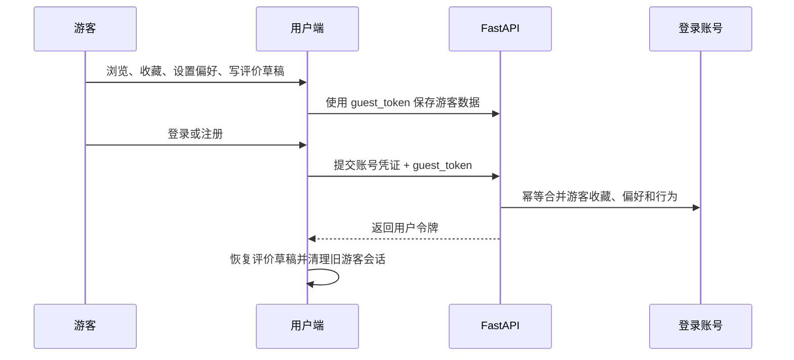
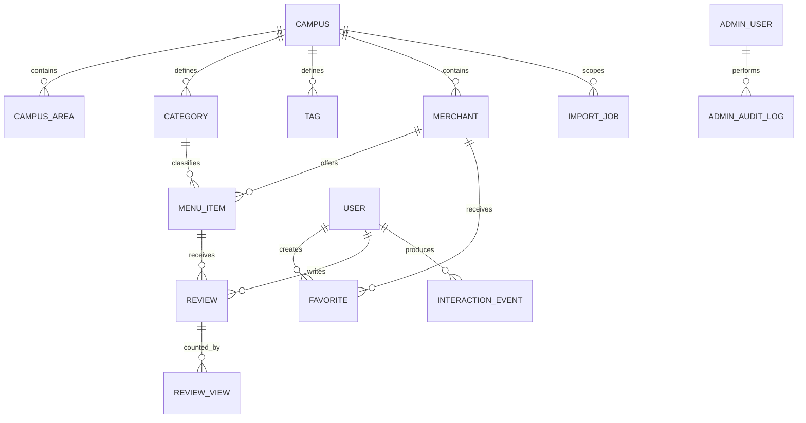

# Campus Foodie 校园饮食推荐系统项目解释文档

> 文档用途：课程设计说明、项目答辩、PPT 内容提炼、Word 项目报告撰写。
> 项目阶段：初版（MVP）。
> 建议使用时，将文中的“截图建议”和“最终验收数据”替换为最新界面截图与测试结果。

---

## 1. 项目一句话介绍

Campus Foodie 是一个面向校园场景的智能饮食推荐系统。系统以“菜品或套餐”为推荐主体，结合用户主动填写的口味偏好和近期浏览、搜索、收藏等行为建立去标识化画像，再通过 DeepSeek 对数据库中的候选 ID 进行安全重排。数据库约束候选范围，但不为候选的现实营业状态或演示菜单背书。

## 2. 30 秒项目介绍

校园里的餐饮选择很多，但学生通常只能依靠熟人推荐、零散评价或反复试错。Campus Foodie 将菜品推荐、地图发现、用户评价流程和后台治理整合到一个系统中：用户可以直接查看个性化菜品推荐，在地图上筛选附近商家，发表带评分、文字和图片的评价；管理员可以维护商家与菜品、审核评价、导入数据并查看审计日志。当前预置菜单和评价是明确标识的演示数据，真实用户内容需要在后续实际使用中逐步积累。FastAPI 后端负责认证、推荐、地图、评价和管理 API，DeepSeek 只负责重排数据库已经筛选出的合法候选，模型异常时系统仍可使用确定性算法正常运行。

## 3. 项目背景

### 3.1 现实问题

校园饮食场景具有以下特点：

- 商家、食堂档口和菜品数量较多，信息分散。
- 学生的预算、口味、忌口和活动区域差异明显。
- 传统平台通常优先展示商家，难以回答“今天具体吃什么”。
- 评价可能存在信息过时、内容质量不一或不适合公开的问题。
- 新生和跨校区学生对地点、距离和营业情况不熟悉。

### 3.2 项目切入点

本项目不把“商家”作为推荐终点，而是直接推荐“菜品或套餐”。商家是菜品的归属实体，也是地图展示和收藏对象。这样可以缩短用户从“想吃饭”到“决定吃什么”的决策路径。

### 3.3 项目价值

- 对学生：降低选餐成本，获得更符合个人口味和预算的建议。
- 对商家：正式运营后，优质菜品可以通过经审核发布的真实用户评价被发现，而不只依赖商家整体热度；当前演示评分不代表真实口碑。
- 对学校或运营方：通过统一后台维护校园餐饮目录、审核内容和分析使用情况。
- 对开发研究：验证大模型在受约束推荐、文本审核和降级设计中的工程应用。

## 4. 建设目标与范围

### 4.1 核心目标

1. 构建移动优先的校园饮食推荐用户端。
2. 构建与用户端端口、登录态和权限体系分离的管理端。
3. 使用 FastAPI 提供模块化、可扩展的 REST API。
4. 使用 DeepSeek 完成候选重排、推荐理由和评价辅助审核。
5. 在没有 DeepSeek Key 或高德地图 Key 时仍能运行核心功能。
6. 通过校园隔离、幂等写入、游标分页和统一错误格式提高系统可靠性。

### 4.2 初版包含的功能

- 首页个性化菜品/套餐推荐。
- 品类、地点、关键词和预算筛选。
- 菜品详情、评价阅读、商家收藏。
- “我也吃过”独立评价入口。
- 评分、文字和最多 9 张图片的评价。
- 校园地图筛选、商家点位聚合和收藏星标。
- 游客使用、账号登录、邮箱验证和密码找回路径。
- 个人偏好、收藏、评价和阅读影响统计。
- 用户、商家、菜品、标签、评价、CSV 导入和审计日志管理。
- Swagger、ReDoc 和 OpenAPI API 文档。

### 4.3 初版暂不作为核心交付的内容

- 在线支付、外卖配送和订单履约。
- 商家自主入驻及结算。
- 完整的社交关注、私信和动态广场。
- 依赖大规模线上数据训练的自研推荐模型。
- 商业地图坐标转换和高精度室内导航。

### 4.4 当前数据真实性边界

- 正式校名和通讯地址来自中南林业科技大学官网。
- 当前 11 个商家名称、地址和坐标来自 2026-07-22 高德地点搜索结果，只作为 POI 候选；它们不等同于校方营业证明或实地核验结果。
- 当前商家营业时段，以及 96 个菜名及其价格、描述、评分和种子评价均为演示生成。`published` 是评价工作流的可见状态，不表示评价来自真实消费者。
- 商家/菜品描述与种子评价文本保存演示说明，但用户端尚未承诺在每个卡片、地图点位和详情区域显示统一的演示徽标。
- 未来用户主动提交并经审核发布的评价应与种子演示评价区分保存和解释；正式上线前还需用门店核验数据替换演示菜单。

## 5. 用户角色与典型场景

| 角色 | 主要需求 | 可用能力 |
| --- | --- | --- |
| 游客 | 快速浏览，不希望先注册 | 推荐、搜索、地图、偏好、游客收藏；可先写评价草稿 |
| 登录用户 | 获得持续个性化体验 | 评价、图片上传、账号收藏、个人统计、偏好管理 |
| 管理员 | 维护业务数据和内容质量 | 用户管理、商家/菜品管理、标签、审核、导入、审计 |
| 系统运营者 | 保证服务稳定和数据安全 | 配置环境、查看日志、执行迁移、部署和监控 |

### 5.1 典型用户故事

> 一名学生中午下课后打开 Campus Foodie。系统根据其“微辣、预算 20 元以内、常去图书馆附近”的偏好，推荐一份藤椒鸡双拼饭。学生查看菜品详情和同学评价后收藏所属商家，并在地图中查看位置。用餐后，他从菜品详情页点击“我也吃过”，提交 5 星评价和一张图片。评价经过规则与 DeepSeek 辅助审核，不确定时进入管理员人工审核队列；发布后，其他同学的阅读会计入该用户的影响力统计。

## 6. 总体架构

项目采用“前后端分离的模块化单体”架构。初版优先保证开发效率、模块边界和可部署性，同时为后续服务拆分保留接口。



### 6.1 架构特点

- 用户端和管理端使用不同端口与不同令牌 audience。
- 后端共享业务数据库，但按校园和权限隔离数据。
- 推荐、搜索、目录、地图、评价、收藏、个人中心等路由分模块维护。
- DeepSeek 是可选增强组件，不是核心浏览流程的单点依赖。
- 开发环境可直接使用 SQLite，部署环境可切换 PostgreSQL/PostGIS。

## 7. 技术栈

| 层级 | 技术 | 作用 |
| --- | --- | --- |
| 用户前端 | React 18、TypeScript、Vite、Ant Design Mobile | 移动端页面、组件和交互 |
| 状态与请求 | TanStack Query、React Context | 服务端状态缓存、登录态和游客态管理 |
| PWA | vite-plugin-pwa、Workbox | 应用壳缓存、安装体验和公开资源离线能力 |
| 管理前端 | React 18、TypeScript、Ant Design | 桌面管理界面、表格、表单和审核操作 |
| API 后端 | Python 3.13、FastAPI、Pydantic | REST API、校验、OpenAPI 文档 |
| 数据访问 | SQLAlchemy 2、Alembic | ORM、事务和数据库迁移 |
| 数据库 | SQLite / PostgreSQL + PostGIS | 开发存储与生产扩展 |
| AI | DeepSeek Chat Completions API | 推荐重排、推荐理由、评价辅助审核 |
| 图片处理 | Pillow | 格式识别、解码、尺寸限制、重编码和 EXIF 清除 |
| 测试 | Pytest、Vitest、Testing Library、Playwright | 后端、前端组件和端到端测试 |
| 自动化 | GitHub Actions、PowerShell 检查脚本 | CI、构建、测试、迁移和契约审计 |
| 部署 | Docker、Docker Compose、Uvicorn | 本地联调和服务部署 |

## 8. 用户端功能设计

### 8.1 首页

首页承担“快速决定吃什么”的核心任务：

- 顶部头像/用户入口和菜品搜索栏。
- 品类与地点二级筛选。
- 根据用户画像持续加载的菜品或套餐推荐卡片。
- 卡片展示图片、菜品名称、所属商家、评分、价格和个性化推荐理由。
- 点击卡片进入菜品详情；点击星标收藏该菜品所属商家。

推荐卡片采用左侧图片、右侧信息的紧凑布局，延续设计稿“食物和评价是视觉主角”的思路。

### 8.2 “我也吃过”入口

“我也吃过”是底部导航中央的独立按钮，不嵌套在“首页”按钮中。用户可以从该入口先选择菜品，再发表评价；在菜品详情页底部也可以针对当前菜品发起评价。

评价表单支持：

- 1—5 星评分。
- 最长 2000 字的文字内容。
- 最多 9 张图片。
- 游客先保存草稿，提交时登录，登录后恢复草稿。
- 展示机器审核或人工审核状态。

### 8.3 地图

地图页解决“在哪里吃”的问题：

- 搜索商家或地点。
- 按价格、餐饮类别、口味和是否收藏筛选。
- 相邻过近的商家在低缩放级别聚合显示。
- 收藏商家使用星标；聚合中包含收藏商家时也显示星标。
- 点击点位或聚合结果查看商家信息和相关菜品。

配置高德 Key 时加载高德底图和地图服务；未配置或加载失败时使用校园示意地图，但保留筛选、聚合和收藏语义。加载商业底图不等于图上的 POI 已被校方或门店核验。

### 8.4 我的

个人中心展示：

- 已发布评价数量。
- 累计阅读次数，即评价影响力。
- 我的收藏。
- 我的评价及审核状态。
- 口味、忌口、预算和常去地点。
- 登录、注册、邮箱验证、密码找回和退出。

首次使用不强制登录；评价等需要身份归属的操作才要求登录。

## 9. 管理端功能设计

管理端使用独立端口 `5174` 和独立登录态，避免用户令牌与管理员令牌混用。

### 9.1 用户管理

- 按用户名、邮箱或用户 ID 查询。
- 查看必要的账号状态和业务统计。
- 冻结或恢复账号。
- 触发密码重置流程。
- 不显示、返回或修改用户明文密码。

### 9.2 商家与菜品管理

- 新增、编辑、删除和上下架商家。
- 使用地图选点录入 WGS-84 经纬度。
- 新增、编辑、删除和上下架菜品或套餐。
- 设置价格、图片、品类和服务端标签。
- 维护校园地点、品类和标签字典。

### 9.3 评价管理

- 查看待人工审核、已发布、驳回和隐藏评价。
- 按状态、评分和关键词筛选。
- 通过、驳回、下架或恢复评价。
- 填写可复核的处置原因。

### 9.4 数据导入与审计

- CSV 预校验，先返回字段和行级错误，再执行导入。
- 支持地点、商家和菜品数据导入。
- 管理员写操作记录到审计日志。
- 审计记录包含操作者、操作类型、对象、时间和变更信息。

## 10. FastAPI 后端模块

| 模块 | 主要职责 |
| --- | --- |
| `auth.py` | 游客会话、注册、登录、刷新、登出、邮箱验证、密码重置 |
| `discovery.py` | 推荐流、搜索建议、综合搜索 |
| `catalog.py` | 校园、地点、品类、标签、商家、菜品和公开评价目录 |
| `map.py` | 地图筛选、GeoJSON 点位和聚合 |
| `favorites.py` | 收藏和取消收藏商家 |
| `reviews.py` | 评价创建、编辑、删除和阅读统计 |
| `profile.py` | 个人偏好、本人评价、收藏和统计 |
| `events.py` | 点击、搜索、收藏、详情阅读等行为事件 |
| `uploads.py` | 评价图片安全上传 |
| `admin/` | 用户、目录、商家、菜品、导入、审核和审计管理 |

公开接口统一位于 `/api/v1`，管理接口统一位于 `/admin/api/v1`。

## 11. 核心业务流程

### 11.1 个性化推荐流程



确定性排序综合考虑评分、评价量、预算、忌口、口味、常去地点和收藏等信号。模型不能创造数据库中不存在的推荐对象。

### 11.2 评价发布与审核流程



模型不可用时不会阻塞用户提交，也不会直接误发布，而是转交人工审核。

### 11.3 游客转登录用户流程



## 12. DeepSeek 接入设计

### 12.1 应用位置

DeepSeek 在本项目中承担两类辅助任务：

1. 推荐：对数据库候选进行重排，并生成简短的个性化推荐理由。
2. 审核：辅助判断评价文本是否适合公开，无法确定时转入人工队列。

### 12.2 为什么不让大模型直接推荐任意菜品

如果直接让大模型自由生成菜品或商家，可能出现“幻觉”，例如推荐数据库中不存在、已经下架或不属于当前校园的对象。本项目采用“数据库召回 + 模型受约束重排”模式：

- 候选先由数据库产生。
- Prompt 只允许模型返回候选 ID。
- 服务端验证返回 ID 是否属于候选集合。
- 任何非法结果都回退到本地确定性排序。

### 12.3 隐私边界

发送给 DeepSeek 的画像只包含：

- 口味和饮食标签。
- 预算区间。
- 常去校园区域 ID。
- 点击、收藏、详情阅读等聚合信号。
- 经过本地标签匹配后的搜索信号。

不会发送：

- 用户名、邮箱和账号 ID。
- Bearer Token 或登录凭据。
- 评价原文用于推荐画像。
- 未处理的原始搜索文本。
- 单纯曝光数据用于偏好推断。

## 13. 数据模型概览



### 13.1 关键数据原则

- 所有校园业务资源持久化非空 `campus_id`。
- 评价关联菜品或套餐，不直接关联商家评分。
- 收藏对象是商家，推荐对象是菜品或套餐。
- 只有已发布且未删除的评价参与评分。
- `published` 只控制公开可见性和评分资格，不证明评价来源真实；种子生成评价仍属于演示内容。
- 跨校园地点、品类、标签、商家和菜品 ID 不能组合写入。

### 13.2 评分计算

- 菜品评分：对已发布评价进行贝叶斯平滑，降低少量极端评价造成的波动。
- 商家评分：根据各菜品的有效评价数量进行平方根加权，避免单个低样本菜品支配商家总分。
- 评价状态变化、编辑或删除后，重新计算相关评分。

## 14. API 工程设计

### 14.1 校园隔离

涉及校园业务的数据请求必须声明 `campus_id`。服务端同时校验被引用资源是否属于同一校园，防止仅依靠前端筛选造成的数据越界。

### 14.2 游标分页

业务列表使用不透明游标，而不是让客户端直接操作数据库偏移量：

```json
{
  "items": [],
  "next_cursor": "opaque-cursor",
  "has_more": true
}
```

游标适合推荐流、评价、个人记录和后台列表持续加载，也能减少数据新增时 offset 分页产生的重复或遗漏。

### 14.3 写入幂等

对可重试写请求使用 `Idempotency-Key`：

- 相同键和相同请求：重放原成功响应。
- 相同键但请求内容不同：返回 `409`。
- 收藏、评价阅读和行为事件还具有领域级去重机制。

该设计能降低移动网络重试造成的重复评价、重复计数或重复管理操作。

### 14.4 统一错误格式

错误响应采用 RFC 9457 风格的 Problem Details，并包含请求 ID：

```json
{
  "type": "about:blank",
  "title": "请求参数无效",
  "status": 422,
  "detail": "请检查提交字段",
  "request_id": "..."
}
```

客户端可以稳定展示错误，服务端也能通过 `X-Request-ID` 关联日志。

## 15. 地图与坐标设计

- 商家保存 WGS-84 原始坐标和 GCJ-02 展示坐标。
- 地图 API 返回 GeoJSON，并明确 `coordinate_system`。
- 低缩放级别按 Web-Mercator 像素网格进行服务端聚合。
- 普通点包含 `is_favorite`，聚合点包含 `has_favorite`。
- 管理端地图选点输出 WGS-84 坐标。
- 正式导入商业地图数据时，应提供准确的 GCJ-02 坐标或接入合规转换服务。

## 16. 安全与隐私设计

### 16.1 身份与权限

- 访问令牌和旋转刷新令牌分离。
- 用户令牌与管理员令牌使用不同 audience。
- 管理接口需要管理员角色。
- 用户只能修改自己的评价和引用自己的上传图片。

### 16.2 密码与账号

- 密码只保存安全哈希，不保存明文。
- 管理端不能查看或修改明文密码。
- 邮箱验证和密码重置使用一次性令牌。
- 本地演示账号仅用于开发，生产环境必须删除并更换密钥。

### 16.3 图片安全

- 不只相信扩展名或客户端 MIME。
- 服务端完整解码图片并验证真实格式。
- 限制文件大小和像素数量。
- 重编码后保存，从而清除 EXIF 等元数据。
- 验证评价引用图片确实属于当前用户。

### 16.4 缓存边界

- PWA 缓存公开应用壳和静态资源。
- 个人 API 响应不做持久化离线缓存。
- 退出或令牌过期时清除账号收藏、私有查询缓存和评价草稿。
- 游客收藏与登录账号收藏分离。

## 17. 稳定性与降级策略

| 外部能力异常 | 系统行为 |
| --- | --- |
| DeepSeek 未配置、超时或限流 | 推荐使用确定性排序；评价进入人工审核 |
| DeepSeek 返回坏 JSON 或候选外 ID | 丢弃模型结果并回退本地排序 |
| 高德 Key 未配置或脚本加载失败 | 使用校园示意地图 |
| 菜品图片加载失败 | 显示与品类匹配的渐变占位图 |
| SMTP 未配置 | 非生产环境返回调试令牌，核心账号流程仍可测试 |
| Redis 不可用 | 初版核心流程不依赖 Redis，继续使用数据库路径 |

降级设计的核心原则是：外部 AI 和地图能力用于增强体验，但不能阻断浏览、推荐、提交和管理等核心业务。

## 18. 部署与运行

### 18.1 本地开发端口

| 服务 | 默认地址 |
| --- | --- |
| 用户端 | `http://localhost:5173` |
| 管理端 | `http://localhost:5174` |
| FastAPI | `http://localhost:8000` |
| Swagger UI | `http://localhost:8000/docs` |
| ReDoc | `http://localhost:8000/redoc` |
| OpenAPI | `http://localhost:8000/openapi.json` |

### 18.2 本地启动命令

```powershell
# 后端
& 'C:\Python313\python.exe' -m venv .venv
& '.\.venv\Scripts\python.exe' -m pip install -e '.\backend[dev,postgres,redis]'
& '.\.venv\Scripts\python.exe' -m uvicorn app.main:app --app-dir backend --reload --port 8000

# 前端
pnpm install
pnpm dev:user
pnpm dev:admin
```

### 18.3 容器化部署

`docker-compose.yml` 提供：

- PostgreSQL/PostGIS。
- Redis。
- Mailpit 邮件联调。
- FastAPI 服务。
- 数据库、缓存和上传文件持久卷。

```powershell
docker compose up --build
```

生产环境至少需要：

- 设置随机且独立的 `SECRET_KEY`。
- 设置 `ENVIRONMENT=production`。
- 设置 `AUTO_SEED=false`。
- 使用 Alembic 执行数据库迁移。
- 配置正式数据库、HTTPS、反向代理、CORS、邮件和上传存储。
- 删除开发演示账号和演示数据。

## 19. 测试与质量保障

项目采用分层测试策略：

| 测试层级 | 工具 | 重点验证 |
| --- | --- | --- |
| 后端单元/集成 | Pytest | 认证、校园隔离、评分、幂等、分页、审核、上传、管理 API |
| 前端组件 | Vitest、Testing Library | 页面渲染、状态管理、HTTP 映射、表单和交互 |
| 端到端 | Playwright | 用户评价到管理审核、游客阅读、地图星标、管理 CRUD/导入/审计 |
| 静态契约 | `scripts/static_audit.py` | 路由边界、核心文件和关键 UI/API 契约 |
| 构建检查 | TypeScript、Vite | 类型安全和生产构建 |
| 数据库验证 | Alembic | 全新数据库迁移到最新版本 |
| API 文档 | OpenAPI 导出脚本 | 完整、用户端和管理端机器可读文档 |

常用检查命令：

```powershell
& '.\.venv\Scripts\python.exe' -m pytest backend\tests
pnpm typecheck
pnpm test
pnpm build
pnpm test:e2e
powershell -ExecutionPolicy Bypass -File .\scripts\check.ps1
```

> 最终测试数量、覆盖率、构建结果和浏览器检查结果，应从最新 CI 或 `docs/REQUIREMENTS.md` 中复制到 PPT/Word，不建议在文档模板中写死。

## 20. 项目特色与创新点

### 20.1 从“推荐商家”转为“推荐具体菜品”

用户最终需要做出的决定是“吃什么”，因此系统将菜品或套餐作为推荐主体，信息更加直接。

### 20.2 大模型受约束重排

DeepSeek 不能自由创造推荐对象，只能重排数据库候选 ID。该设计同时利用大模型的语义能力和传统系统的可控性。

### 20.3 可运行的降级路径

没有 DeepSeek Key 或地图 Key 时，系统仍可完成推荐、浏览、评价提交和示意地图展示，适合开发演示和渐进式部署。

### 20.4 游客优先体验

首次使用不要求登录。游客收藏、偏好和行为可在登录时幂等合并；评价可以先写草稿，最后提交时再登录。

### 20.5 多校园隔离基础

虽然初版 UI 默认单校园，后端主要业务资源已经以 `campus_id` 隔离，为多校区或多学校部署打下基础。

### 20.6 内容治理闭环

评价经过本地规则、AI 辅助和人工审核；管理操作进入审计日志，形成“用户贡献—内容审核—公开展示—影响统计”的闭环。

## 21. 当前局限与后续规划

### 21.1 当前局限

- 初版推荐数据量有限，画像效果主要依赖规则和少量行为信号。
- 历史调研资料和高德地点搜索结果都不能直接视为当前实时营业证明；当前 POI 仍需校方、门店或实地复核。
- 当前商家营业时段，以及菜单、价格、评分和种子评价均为演示生成，不能用于描述门店实际供应或真实口碑。
- 字段中已有演示说明，但用户端各界面尚未统一展示演示徽标。
- 部分图片许可证未知，公开界面使用原创占位图，正式上线需要商家授权素材。
- 室内楼层、档口级高精度导航尚未实现。
- Redis、PostGIS 等能力已经预留，但初版核心逻辑仍以数据库和应用层实现为主。

### 21.2 后续路线

1. 接入学校统一身份认证或微信、企业微信等第三方登录。
2. 建立商家营业时间、拥挤度和菜品售罄的实时更新机制。
3. 增加基于时间段、天气和课程地点的情境推荐。
4. 使用 Redis 实现热点缓存、分布式限流和异步任务。
5. 使用 PostGIS 完成更高效的视口与距离查询。
6. 建立推荐效果指标，如点击率、收藏率、评价转化率和多样性。
7. 引入举报、申诉、敏感内容复核和管理员分级权限。
8. 建立图片授权、来源记录和内容版权管理流程。

## 22. 项目演示脚本

以下流程适合 5—8 分钟现场演示。开始操作前应先说明：地图商家是高德 POI 候选，菜单、价格、营业时段、评分和种子评价是演示内容；字段中已有说明，但当前界面尚未统一显示演示徽标。

### 第一部分：用户发现（约 1.5 分钟）

1. 以游客身份打开用户端首页。
2. 说明顶部搜索、品类和地点筛选。
3. 展示推荐卡片中的菜品、商家、评分、价格和个性化理由。
4. 进入菜品详情，查看公开评价并收藏所属商家。

### 第二部分：地图发现（约 1 分钟）

1. 进入地图页。
2. 切换价格、类别、口味和收藏筛选。
3. 解释普通点、收藏星标和聚合星标。
4. 如未配置高德 Key，说明当前展示的是功能等价的示意地图降级方案。

### 第三部分：发表评价（约 1.5 分钟）

1. 从推荐卡片进入对应菜品详情，点击页面底部“我也吃过”。
2. 填写星级、文字和图片。
3. 展示游客先写草稿、登录后恢复的流程。
4. 提交后说明评价进入机器或人工审核状态。

### 第四部分：管理审核（约 1.5 分钟）

1. 打开独立管理端并登录。
2. 在评价队列中找到刚提交的评价。
3. 执行通过或驳回并填写原因。
4. 展示商家地图选点、菜品标签字典或 CSV 预校验中的一个功能。
5. 打开审计日志，说明管理行为可追踪。

### 第五部分：形成闭环（约 1 分钟）

1. 回到游客页面查看已发布评价。
2. 模拟其他用户阅读评价。
3. 回到作者“我的”页面，展示已发布评价数和累计阅读量。
4. 总结“推荐—决策—评价—审核—影响统计”业务闭环。

## 23. PPT 生成提纲

建议制作 14—16 页，控制在 8—12 分钟。

| 页码 | 页面标题 | 建议内容 | 建议视觉素材 |
| --- | --- | --- | --- |
| 1 | 项目封面 | 项目名称、成员、课程/单位、日期 | Logo、首页主视觉 |
| 2 | 背景与痛点 | 信息分散、选择困难、个体差异、内容治理 | 痛点图标或校园用餐场景 |
| 3 | 解决方案 | 一句话定位和核心价值 | “推荐具体菜品”对比图 |
| 4 | 用户与场景 | 游客、用户、管理员及用户故事 | 用户旅程图 |
| 5 | 功能总览 | 首页、地图、我的、管理端 | 四宫格截图 |
| 6 | 用户端首页 | 搜索、筛选、个性化卡片 | 390×844 首页截图 |
| 7 | 地图与评价 | 聚合星标、“我也吃过”、图片评价 | 地图与评价页并排截图 |
| 8 | 管理端 | 用户、商家、菜品、审核、导入、审计 | 管理端桌面截图 |
| 9 | 系统架构 | 两个前端、FastAPI、数据库、DeepSeek | 本文总体架构图 |
| 10 | 推荐与 DeepSeek | 数据库召回、受约束重排、确定性降级 | 推荐流程图 |
| 11 | 评价审核闭环 | 规则、AI、人工审核、公开评分 | 审核流程图 |
| 12 | 数据与 API 工程 | 校园隔离、游标、幂等、Problem Details | API 要点卡片 |
| 13 | 安全与隐私 | 去标识化画像、图片重编码、权限隔离 | 安全边界图 |
| 14 | 测试与部署 | 分层测试、CI、Docker、OpenAPI | 测试矩阵和流水线 |
| 15 | 特色与成果 | 菜品级推荐、游客体验、可靠降级 | 3—5 个亮点数字/图标 |
| 16 | 总结与展望 | 项目价值、局限、下一步 | 路线图、Q&A |

### 23.1 PPT 口播主线

可以用以下四句话贯穿全场：

1. “我们解决的不是在哪里吃，而是今天具体吃什么。”
2. “大模型只重排数据库候选，因此推荐更智能，同时不会凭空创造商家或菜品。”
3. “即使没有 DeepSeek 或高德 Key，系统仍然保持核心功能可用。”
4. “系统形成了从个性化推荐、用户评价到管理员审核和影响统计的完整闭环。”

### 23.2 PPT 截图清单

- 用户端首页 390×844。
- 菜品详情与公开评价。
- 地图普通点、收藏星标和聚合点。
- “我也吃过”评价编辑页。
- “我的”统计页。
- 管理端仪表盘。
- 商家地图选点和菜品标签选择。
- 评价审核队列。
- CSV 预校验结果。
- 审计日志。
- Swagger 或 ReDoc 页面。
- CI/测试成功结果。

## 24. Word 项目报告建议目录

### 摘要

说明项目背景、目标、技术方案、主要成果和关键词，建议 300—500 字。

### 第一章 绪论

1. 研究背景。
2. 校园饮食推荐的现实需求。
3. 国内外同类产品或技术现状。
4. 项目目标、范围与主要工作。

### 第二章 需求分析

1. 用户角色分析。
2. 用户端功能需求。
3. 管理端功能需求。
4. 非功能需求：性能、安全、扩展性、可用性。
5. 业务流程与用例图。

### 第三章 系统总体设计

1. 架构选型与理由。
2. 技术栈。
3. 前后端模块划分。
4. 部署架构。
5. 系统降级策略。

### 第四章 数据库与 API 设计

1. 核心实体和 ER 图。
2. 校园数据隔离。
3. 评分聚合规则。
4. REST API 路由设计。
5. 游标分页、幂等和统一错误格式。

### 第五章 核心功能实现

1. 首页推荐与动态筛选。
2. 地图聚合和收藏星标。
3. 评价、图片上传和草稿恢复。
4. 个人中心与影响力统计。
5. 管理端 CRUD、审核、导入和审计。

### 第六章 DeepSeek 应用设计

1. 大模型接入目标。
2. 去标识化用户画像。
3. 候选约束和 Prompt 输出格式。
4. 推荐重排流程。
5. 评价审核流程。
6. 超时、限流、坏 JSON 和幻觉 ID 降级。

### 第七章 安全与隐私

1. 用户与管理员权限隔离。
2. 账号、令牌和密码安全。
3. 图片安全处理。
4. AI 数据最小化。
5. PWA 缓存和退出清理。

### 第八章 测试与部署

1. 测试环境。
2. 后端测试。
3. 前端组件测试。
4. 端到端测试。
5. 数据库迁移与 OpenAPI 验证。
6. Docker 部署和生产注意事项。

### 第九章 总结与展望

1. 项目成果。
2. 特色与创新点。
3. 当前不足。
4. 后续迭代方向。

### 附录

- 主要 API 表。
- 环境变量说明。
- 演示账号说明。
- 测试结果截图。
- 关键代码或 Prompt 示例。

## 25. 可直接使用的摘要示例

本文设计并实现了一套基于 FastAPI 和 DeepSeek 的校园饮食推荐系统 Campus Foodie。系统针对校园餐饮信息分散、学生选择成本高以及个体口味差异明显等问题，以菜品或套餐而非商家作为推荐主体，提供个性化推荐、地图发现、商家收藏、用户评价流程和个人影响力统计等功能。当前商家目录采用待复核的高德 POI 候选；商家营业时段，以及菜单、价格、评分和种子评价为明确说明的演示内容，真实用户评价需要在正式使用中积累。系统采用 React 构建移动端 PWA 和独立管理端，使用 FastAPI、SQLAlchemy 与 Alembic 构建模块化 API 和数据层，并通过校园标识实现业务数据隔离。推荐模块先从数据库召回合法候选，再将去标识化用户画像和候选摘要发送给 DeepSeek 进行受约束重排；当模型超时、限流、返回非法 JSON 或虚构候选 ID 时，自动回退到确定性排序。评价模块结合本地规则、DeepSeek 辅助审核和管理员人工审核，图片上传执行真实格式识别、解码、像素限制、重编码和 EXIF 清除。系统还实现了游标分页、写入幂等、Problem Details 错误响应、地图点位聚合和 PWA 缓存边界。该项目验证了大模型在校园垂直推荐场景中的可控应用方式，并形成了从推荐、决策、评价到审核和影响统计的完整业务闭环。

**关键词：** 校园饮食；FastAPI；DeepSeek；推荐系统；用户画像；React；内容审核

## 26. 常见答辩问题与参考回答

### Q1：为什么推荐菜品而不是商家？

因为用户最终需要决定的是“吃什么”。只推荐商家还需要用户再次进入菜单选择，菜品级推荐可以缩短决策链路；正式运营后，同一商家的不同菜品还可以根据经审核的真实用户评价获得不同排序。当前演示评分只验证这一算法流程，不代表真实口碑。

### Q2：为什么需要 DeepSeek，规则推荐不够吗？

规则推荐稳定且可解释，但对复杂口味组合和自然语言理由的处理能力有限。DeepSeek 用于理解去标识化偏好、重排候选和生成推荐理由；基础排序仍由本地算法完成，因此模型是增强层而不是唯一决策层。

### Q3：如何避免大模型幻觉？

模型只能返回服务端提供的候选 ID。后端验证结果是否为候选集合的子集，并检查 JSON、重复 ID 和数量。任何不合法结果都被丢弃，使用确定性排序返回。

### Q4：DeepSeek 不可用时系统还能运行吗？

可以。推荐回退到本地确定性排序，评价转入人工审核队列。核心浏览、搜索、地图、收藏和提交不依赖模型成功。

### Q5：如何保护用户隐私？

系统只向模型发送口味标签、预算、区域 ID 和聚合行为，不发送用户名、邮箱、令牌、评价原文或原始搜索文本。个人数据不进入 PWA 持久缓存，退出时清除账号派生缓存。

### Q6：为什么要做游客模式？

饮食推荐属于低门槛高频场景，如果首次打开就要求注册，会显著增加流失。游客可以先浏览、收藏和写草稿，登录时再幂等合并数据。

### Q7：商家评分如何计算？

先根据处于 `published` 状态的评价计算菜品的贝叶斯平滑评分，再按菜品有效评价数量的平方根对商家下各菜品加权，避免只有少量评价的菜品对商家总分产生过大影响。`published` 只表示审核后的可见状态；当前种子评价带“非真实用户评价”标识，所得评分仅用于演示。

### Q8：为什么使用游标分页而不是 offset？

推荐流和评价列表会不断新增数据。offset 在数据变化时容易重复或遗漏，游标使用稳定排序键继续查询，更适合持续加载和移动端信息流。

### Q9：如何防止用户重复提交？

HTTP 写请求支持 `Idempotency-Key`，相同请求可以安全重放；收藏使用唯一约束，阅读和行为事件使用稳定事件 ID 进一步做领域去重。

### Q10：为什么选择模块化单体而不是微服务？

初版团队规模和业务量有限，模块化单体能降低部署和调试成本，同时通过路由、服务和数据边界保持清晰结构。未来当推荐、上传或审核出现独立扩展需求时，可以按现有模块边界拆分服务。

## 27. 演示账号与文档入口

本地开发演示账号：

- 普通用户：`demo` / `Demo123!`
- 管理员：`admin` / `Admin123!`

> 以上账号仅限本地演示，生产环境必须删除。

API 文档入口：

- Swagger UI：`http://127.0.0.1:8000/docs`
- ReDoc：`http://127.0.0.1:8000/redoc`
- OpenAPI：`http://127.0.0.1:8000/openapi.json`
- 人工维护接口文档：`backend/API.md`
- 验收矩阵：`docs/REQUIREMENTS.md`

## 28. 总结

Campus Foodie 的核心不是简单增加一个大模型接口，而是将 AI 放在一个可验证、可降级、可审计的业务流程中。数据库和外键约束保证推荐 ID 来自已存储候选并保持引用一致，但不证明候选地点正在营业，也不把演示菜单或 `published` 种子评价变成真实数据。确定性算法保证基础可用，DeepSeek 提升语义理解和推荐理由质量，人工审核负责内容合规与可见性而非事实背书，用户端与管理端共同形成完整闭环。该架构适合作为校园场景的初版产品，也为后续 POI 实地核验、真实用户内容、多校园和更复杂推荐算法提供了清晰扩展路径。
